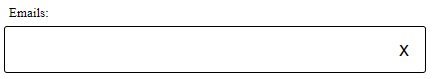
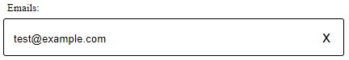
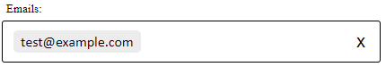

# Tag Input Box
## Introduction
The Tag Input Box is a **React** component providing the user with an input field used to enter and modify tags. These tags are 
contained within the input box, and can be selected/modified/deleted. There are key presses that can be used to perform 
these actions with ease.
, label, separators, forceLowerCase
## Props
| Name           | Explanation                                                          | Type     | Required | Default      |
|----------------|----------------------------------------------------------------------|----------|----------|--------------|
| className      | Class name for the container div.                                    | string   | No       | ""           |
| items          | The state variable for the list of tags.                             | array    | Yes      | -            |
| setItems       | The set function for the items state.                                | function | Yes      | -            |
| validator      | Used to perform validation on the inputs before adding them as tags. | function | No       | `() => true` |
| label          | The text label displayed with the input.                             | string   | No       | `false`      |
| labelPosition  | "Top" or "Bottom" relative to the input.                             | string   | No       | `false`      |
| separators     | A list of acceptable separators between tags.                        | array    | No       | `[","]`      |
| forceLowerCase | Determines if tags are set to lower case when submitted.             | boolean  | No       | `false`      |

## Controlling State
you must use a state variable to control the input. Simply create a
state variable with the following syntax:
```jsx
const [items, setItems] = useState([]);
```
You can then pass the state and its set function to TagInputBox as the **items** and **setItems** props:
```jsx
<TagInputBox
    items={ items }
    setItems={ setItems }
    ...
/>
```

## Example
Here is a working example allowing the user to enter email addresses.
```jsx
// A basic regex performing email validation, returning true or false for valid or invalid email
const isEmailValid = input => /^[^@]+@[^@]+\.[^@]+$/.test(input);

// Defining the state variable
const [emails, setEmails] = useState([]);

return (
    // JSX to be returned
    <TagInputBox
        items={ items }
        setItems={ setEmails }
        validator={ isEmailValid }
        label="Emails:"
        separators={ [",", ";"] }
    />
)
```
The input box will initially render as empty.



You can type an email into the box.



To submit the email, we can either type a separator (comma or semicolon, as provided for the `separators` prop), or we 
can press the **Enter** key. At this point, the email is tested against the validator. 

If the validator returns **true**, the email is added as a tag. 



## Tag Functionality
Tags can be modified/deleted using the following built-in functionality:
* Clicking a tag will make it editable, i.e. put its text back in the input box.
* Holding **CTRL** and clicking a tag will select it.
* Clicking the **X**: if there is text in the input box, it will clear it. If there are selected tags, it will delete 
them.
* Pressing **Delete** when the input is empty will delete all selected tags.
* Pressing **Backspace** when the input is empty will make the last tag editable.
* Pressing **CTRL** and **Backspace** does the same as clicking the **X**.

## CSS Classes
You have the option to pass a classname to the component. This will be applied to the container div. You can then use 
the selectors in the table below.
(This is not always necessary, as you may be able to target different parts of the component with their class names).

```jsx
<TagInputBox className="Example" ... />
```

| Element Class       | CSS Selector               | Target Element | Explanation                                                       |
|---------------------|----------------------------|----------------|-------------------------------------------------------------------|
| .TIB_Container      | .Example                   | Container div  | This includes everything: the input and p elements.               |
| .TIB_InputContainer | .Example > div             | Input and tags | This includes the input box (identifiable by the visible border). |
| .TIB_Label          | .Example p                 | Label          | The label element only.                                           |
| .TIB_Tag            | .Example > div > div > div | Tags           | All tags within the input container.                              |
| .TIB_XButton        | .Example button            | the X button   | The clear "X" button to the right of the input.                   |